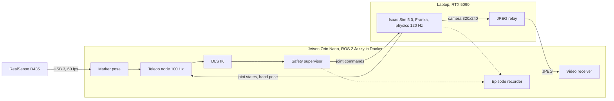

# teleop-ik-stack

Teleoperating a simulated Franka arm from a printed marker held in front of a RealSense camera. The camera and all the control logic run on a Jetson Orin Nano; the arm runs in Isaac Sim on a laptop. I wrote my own IK solver and a safety supervisor that has the final say over every command, then spent most of the time measuring where the latency actually goes and what happens when the network misbehaves.

**Demo (90 s):** [media/teleop_demo.mp4](media/teleop_demo.mp4). Live teleop, reaching past the arm's range, marker dropouts, a 2 s link cut, and an e-stop.

Capture to arm motion is **65 ms p50** end to end. The control loop runs at 100 Hz with p99 period 10.1 ms and no overruns across every session I logged.

## What's in here

- **Marker pose** (`operator/aruco_pose_node.py`): 79.4 mm ArUco marker, D435 colour stream at 60 fps, pose out on ROS 2 stamped with capture time.
- **IK** (`teleop_ik/`): Franka forward kinematics and Jacobian in C++ with Eigen, damped least squares with null-space joint-limit avoidance, velocity limits, random restarts. No MoveIt, no Isaac IK.
- **Safety supervisor** (`teleop_ik/src/safety_supervisor.cpp`): a plain C++ state machine. The IK proposes joint targets; the supervisor decides what is actually sent.
- **Teleop node**: 100 Hz control loop on its own thread, clutch-style engage, workspace box, per-cycle CSV log.
- **Isaac side** (`isaac/`): scripts that move joint I/O onto the physics step, publish the hand pose, retune the joint drives, and add an operator camera. The base scene is NVIDIA's Franka example from Isaac Sim's robotics examples.
- **Measurement tools** (`tools/`): step tests, session analysis by cross-correlation, and a network impairment runner.
- **Video** (`video/`): JPEG relay and a timing receiver.
- **Episode recording** (`episodes/`): one bag per teleop episode, plus an exporter that turns it into a synchronised dataset.

## Architecture



The two machines talk over USB-C device networking, with Fast DDS pinned to that interface (`config/`). Clocks are synced with chrony, laptop as server.

I started on Wi-Fi and dropped it quickly:

| Link | Ping avg | Ping max | Jitter |
|---|---|---|---|
| Wi-Fi, same router | 43.4 ms | 324 ms | 85 ms |
| USB-C networking | 0.35 ms | 1.01 ms | 0.21 ms |

Latency work starts with the transport. Clock offset after chrony settled was 9 µs, RMS 0.48 ms, which bounds every cross-machine number below.

## Stack

Jetson Orin Nano on JetPack 6 (Ubuntu 22.04, which ships ROS 2 Humble, so Jazzy runs in a container to match the laptop). Intel RealSense D435. Laptop with an RTX 5090, Ubuntu 24.04, Isaac Sim 5.0, ROS 2 Jazzy. C++17 and Eigen for the IK and supervisor, Python for tooling, gtest for tests.

## Inverse kinematics

Forward kinematics chains seven transforms from Franka's published modified DH parameters, plus the flange and hand offsets. The Jacobian is the 6x7 matrix that says how the hand moves when each joint moves a little.

Each IK step solves for a joint change that reduces the hand error:

    dq = J^T (J J^T + λ² I)^-1 e

The λ² term is damping. Away from singularities λ is zero. As the smallest singular value of J drops below a threshold, damping ramps up, which trades a bit of accuracy for bounded joint speeds instead of the huge ones a plain inverse asks for near a singularity.

The Franka has seven joints for a six-number task, so there is always some joint motion that leaves the hand still. I use that null space to push joints toward the middle of their range. One detail that cost me a few hours: with damping on, `I - J⁺J` is no longer an exact projector, and the joint-limit push leaked into the task and stalled convergence. Building the projector from the SVD fixed it (full-pose success with restarts went from 472/500 to 497/500).

**Tests (20, gtest)**

| Check | Result |
|---|---|
| FK at q = 0 vs published flange position | exact |
| Jacobian vs finite differences | within 1e-5 |
| Position-only IK, 500 random reachable targets | 500/500 |
| Full-pose IK, single seed / up to 10 restarts | 399/500 / 497/500 |
| Unreachable target | bounded, finite, damping engages |
| Null space moves a joint off its limit, hand stays within 2 mm | pass |
| Streaming a 10 cm circle, one step per 10 ms | 3.3 µm worst |

**Checked against Isaac, not against itself.** Isaac publishes the true hand pose on the same physics step and stamp as the joint angles. Over 2,330 matched pairs, including during motion, my FK was off by **0.024 mm p50, 0.072 mm max** and **0.001° p50, 0.008° max**.

On the Orin, one IK solve takes about 50 to 60 µs typically and around 0.2 ms when the target is out of reach and the solver hits its 10-iteration cap. That is under 3% of the 10 ms cycle.

## Safety supervisor

Same rule as my earlier project: whoever requests motion doesn't get to decide what motion happens.

| Condition | Response |
|---|---|
| E-stop | ESTOP, decelerate; needs release and reset |
| No joint state for 250 ms | FAULT: robot state lost |
| Measured joint outside its limits | FAULT |
| Hand more than 8 cm from command for 0.3 s | FAULT: following error |
| Marker missing over 200 ms | HOLD, resume automatically when it returns |
| Marker missing over 2 s | IDLE: operator lost |
| Any stop | per-joint deceleration at the acceleration limit |
| After FAULT or ESTOP | reset returns to IDLE only; motion needs a fresh engage |

Engage is refused unless joint states are fresh, the marker is visible and the arm is at rest. On engage, the marker's position becomes the zero point and the hand's current pose the anchor, so nothing jumps. Tracking caps speed by stopping distance, so a joint can always brake before its target.

**Live demo timeline** (from `docs/results/demo.csv` and the node log):

| Time (s) | What happened |
|---|---|
| 659.4 | Engaged; tracking p50 under 1 mm |
| 693 to 709 | Reached past the arm's range; IK capped at 10 iterations, arm stopped at its reach and stayed stable |
| 710 to 718 | Six short marker dropouts, HOLD then resume each time |
| 720.0 | Marker gone over 2 s: IDLE, operator lost |
| 741.1 | Link cut: FAULT, robot state lost |
| 762.5 | Engage refused, marker not in view |
| 787.1 | E-stop |
| 802.9 | Reset: stays IDLE |

## Latency

**How it was measured.** Every stamp is wall-clock time on chrony-synced clocks. I added an Isaac graph that publishes joint states and hand pose on every physics step, stamped with system time, since the default publishes once per rendered frame with sim time. Stage times come from stamps in the per-cycle log. Arm response comes from two places: a step test (send a 0.1 rad joint step, measure onset and rise against the publish time, 30 trials) and cross-correlation of the target and actual hand trajectories over 2 s windows.

**The big finding was the joint drives, not the network.** The first session measured 196 ms from capture to arm motion. The step test split that into about 31 ms of delay and 400 ms of rise time. Isaac's default Franka drives (stiffness 400, damping 80) are very soft. Scaling stiffness by F and damping by √F keeps the damping ratio and speeds response by √F:

| Drive stiffness / damping | Onset | Rise 10 to 90% | 90% reached | Settled 2% |
|---|---|---|---|---|
| 400 / 80 (default) | 30.9 ms | 399 ms | 447 ms | 736 ms |
| 4,000 / 253 | 9.4 ms | 149 ms | 162 ms | 264 ms |
| 40,000 / 800 | 15.3 ms | 49.9 ms | 81.0 ms | 114 ms |

At 40,000 the rise time was nearly identical across all 30 trials, which points at a joint speed or torque limit rather than the spring. More stiffness wouldn't help, which is realistic. Onset at this point is mostly waiting for Isaac's next frame burst.

**End to end, before and after** (60 to 90 s of free teleop each):

| | Soft drives | Stiff drives |
|---|---|---|
| Command to Isaac motion, p50 | 158 ms | 30 ms |
| **Capture to Isaac motion, p50** | 196 ms | **65 ms** |
| Capture to Isaac motion, p95 | 252 ms | 117 ms |
| Tracking error, p50 | 8.1 mm | 4.4 mm |
| Tracking error with lag removed, p50 / p95 | 3.0 / 12.2 mm | 0.32 / 3.2 mm |

**Where the 65 ms goes now:** camera capture to pose received 22.8 ms (mostly exposure, readout and USB, roughly one frame at 60 fps), pose to command 5.2 ms (waiting for the next 10 ms tick), command to motion about 30 ms, Isaac to Jetson transport 0.6 ms. The camera is now the largest single piece.

**Feedback rate is bound by rendering.** Joint states per rendered frame came in at 34 Hz. Moving them to the physics step gave 68 Hz at a 2582x1372 viewport and 102 Hz at 1280x720. Isaac runs physics in bursts per rendered frame, so states arrive in clumps rather than evenly.

## Network impairment

The Jetson's kernel has no netem module, so impairment runs on the laptop: netem on the USB interface for outgoing joint states, and incoming commands redirected through an `ifb` device with netem there too. Every condition below is applied in **each direction**. The step test streams the target at 100 Hz like the real loop, and every condition starts from the same clear home pose.

| Condition | Onset p50 | Onset p95 | vs same-day baseline |
|---|---|---|---|
| Baseline (day 1) | 26.4 ms | 32.7 ms | |
| +20 ms | 46.0 ms | 53.3 ms | +19.6 ms |
| +50 ms | 76.8 ms | 85.0 ms | +50.4 ms |
| 50 ± 20 ms jitter | 82.6 ms | 103.3 ms | +56 ms, wider tail |
| 5% loss | 26.2 ms | 34.9 ms | no change |
| Baseline (day 2) | 10.8 ms | 13.5 ms | |
| 20% loss | 17.0 ms | 116.6 ms | typical +6 ms, tail up to 117 ms |

The baseline moved between Isaac sessions (26 vs 11 ms) with the same setup, so each row is only compared against its own day. Onset tracks one-way delay almost one for one, as it should. Streaming at 100 Hz hides 5% loss completely; a lost command is replaced 10 ms later.

**Feedback under 20% loss** peaked at a 200 ms gap with none over 250 ms. That is the data behind the 250 ms robot-state threshold.

**Total link loss** with teleop engaged: link cut at 125.032 s, FAULT at 125.306 s, so **274 ms to detect**. That is the 250 ms threshold plus the age of the last message plus up to one cycle. During the cut Isaac's position drives held the last command, and after the link came back the fault stayed latched until reset.

## Operator video

Isaac renders a 320x240 view of the arm, published every third frame (16.7 fps). A small relay on the laptop JPEG-encodes it; the Jetson measures both streams.

| | Raw RGB | JPEG q80 |
|---|---|---|
| Bandwidth | 30.8 Mbit/s | 0.98 Mbit/s |
| Per frame | 230 KB | 7.3 KB |
| Encode (laptop CPU) | | 0.21 ms |
| Decode (Orin CPU) | | 0.81 ms |
| Render to received, p50 / p99 | 27.0 / 30.3 ms | 27.6 / 31.0 ms |
| Render to decoded, p50 / p99 | | 28.4 / 31.9 ms |

JPEG costs about 1.4 ms and cuts bandwidth 31x. The 27 ms floor is inside Isaac before either stream leaves it (render plus GPU readback), because a 230 KB frame and a 7 KB frame arrive within 0.6 ms of each other. At 320x240 software JPEG is trivial. At 1080p it wouldn't be, and the Orin Nano has no hardware video encoder, so a real system would encode on the sender's GPU.

This is render-to-display for a simulated camera, not true glass-to-glass.

## Episode recording

The recorder watches `/teleop/state`. Engage starts an episode; disengage, FAULT or ESTOP ends it. Each episode is a bag of camera JPEG, joint states, commands, hand pose, marker pose and safety state, plus `meta.json` with duration, end reason and message counts. `clean_end` is false for anything but an operator disengage, so faulted episodes are easy to drop.

`export_episode.py` makes one row per camera frame:

- **Observation:** image (row i of `frames.mp4`), joint position, velocity and effort, hand pose, marker pose, safety mode, each the latest sample at or before the frame.
- **Action:** the first joint command at or after the frame.
- **Ages:** how old each observation was and how far ahead the action was, so stale rows can be filtered.

Nothing from the future leaks into an observation. Action lead came out at 4.9 ms p50, 9.8 ms p99, which is the next 100 Hz command, as expected. A sample episode is in `docs/results/episodes/episode_0001` (video, data and metadata, without the raw bag).

## What went wrong

- **Soft drives looked like latency.** 196 ms end to end was mostly the arm slowly following its command. I only found it by splitting delay from rise time with a step test.
- **The supervisor throttled the arm.** I first fed it one IK step per cycle. Its braking logic caps speed by distance to target, and a target a few milliradians away meant almost no speed. The hand lagged up to 121 mm in live teleop. Feeding it the solved IK target fixed it (41 mm max under brisk motion), and there's a regression test for it now.
- **A nuisance fault at 100 ms.** One Isaac stall of 101 ms tripped "robot state lost" with nothing wrong. Feedback age was 7.6 ms p50, 15.9 ms p99, 58 ms p99.9, 91 ms max over the session. Raised to 250 ms. On a real arm with 1 kHz feedback I'd want 100 ms or less.
- **Invalid step tests.** A whole netem sweep came out with a 276 ms baseline and "20% loss" faster than no loss. Step tests had been starting from wherever teleop left the arm, near enough to the table to rub. Every test now starts from a home pose, and I threw the sweep away.
- **No netem on the Jetson.** Its kernel ships without the module, so impairment moved to the laptop with an ifb device to cover both directions.
- **Feedback starvation once, not reproduced.** One early 20% loss run lost joint states for over 2 s. The rerun showed a 200 ms worst gap. I'm reporting it as seen once.

## Limits

- Everything is simulated except the camera and the Jetson. No real arm, no real motor dynamics.
- Feedback and video rates are bound by Isaac's rendering on the same laptop.
- Isaac stamps camera frames and the last physics step of that frame with the same clock reading, so ordering inside a rendered frame can't be resolved.
- The marker gives position only; hand orientation is held at the engage pose.
- The workspace box never engaged in the demo. The arm's reach was smaller than the box in the direction I moved, and the IK iteration cap is what held it.
- One operator, one marker, short sessions. Netem results are 15 trials per condition.
- The teleop node's default robot-state timeout is still 100 ms in code; the runs above pass 250 ms.

## Repository layout

```
config/       Fast DDS profiles pinning ROS 2 to the USB link
isaac/        physics_rate_graph.py, tune_drives.py, camera_graph.py, franka_teleop.usd
operator/     aruco_pose_node.py
teleop_ik/    C++ package: kinematics, IK, supervisor, teleop node, FK check, tests
tools/        analyze_session.py, step_test_v4.py, netem_experiment_v4.sh
video/        video_relay.py, video_latency.py
episodes/     episode_recorder.py, export_episode.py, align.py
docs/results/ logs, JSON summaries, plots, sample episode
media/        demo video
```

Files with a `_vN` suffix are later versions; the highest number is current.

## Reproduce

```bash
# Laptop: Isaac Sim with the USB DDS profile
export RMW_IMPLEMENTATION=rmw_fastrtps_cpp FASTRTPS_DEFAULT_PROFILES_FILE=$HOME/teleop_ws/fastdds_usb.xml
isaacsim   # open isaac/franka_teleop.usd, viewport 1280x720, Play

# Jetson: Jazzy container with the workspace mounted
docker run -it --name jazzy --net=host --privileged -v /dev:/dev -v ~/teleop_ws:/ws \
  -e RMW_IMPLEMENTATION=rmw_fastrtps_cpp -e FASTRTPS_DEFAULT_PROFILES_FILE=/ws/fastdds_usb.xml \
  ros:jazzy-ros-base bash
cd /ws && colcon build --packages-select teleop_ik && colcon test --packages-select teleop_ik

# Camera and marker
ros2 run realsense2_camera realsense2_camera_node --ros-args -p enable_depth:=false \
  -p rgb_camera.color_profile:=640x480x60 -p global_time_enabled:=true &
python3 aruco_pose_node.py --size 0.0794 --id 0

# Teleop
ros2 run teleop_ik teleop_node --ros-args -p robot_stale_ms:=250.0
ros2 topic pub --once /teleop/engage std_msgs/msg/Bool "{data: true}"

# Measurements
python3 step_test_v4.py --home --joint panda_joint1 --step 0.1 --trials 30
python3 analyze_session.py --csv s2.csv --bag s2_bag --out s2
sudo -v && bash tools/netem_experiment_v4.sh steps 15        # on the laptop
```

## Notes

Built over three days on hardware I already had, using AI coding tools along the way. Everything was run, tested and validated on the real setup before being committed.
