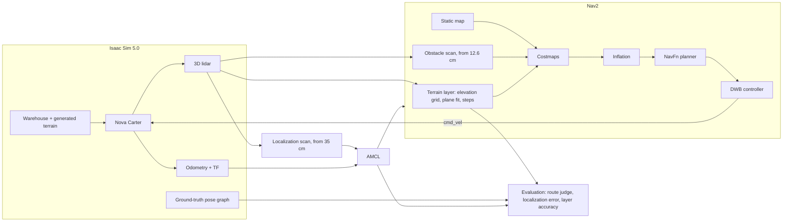
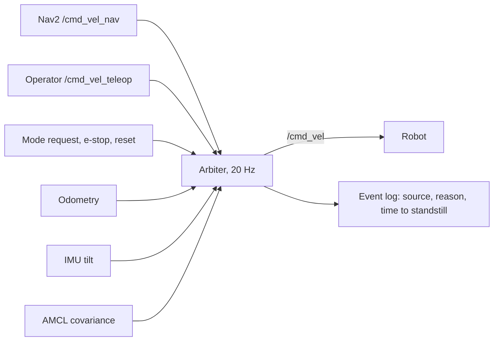
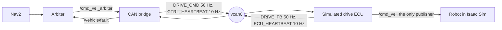

# nav2-terrain-aware-sim

Terrain-aware navigation for a wheeled robot in NVIDIA Isaac Sim 5.0 with ROS 2 Jazzy and Nav2.

Stock Nav2 sees the world as floor or wall. Anything below its obstacle height filter (about 10 to 20 cm here) counts as floor, so ramps, bumps and rough ground are invisible to it. This project adds a costmap layer that measures slope, roughness and height steps from 3D lidar, a ground-truth evaluation pipeline that scores navigation, localization and the layer's own perception against the simulator's true state, a command arbiter that decides who drives the robot and when it must stop, and a CAN layer so every motion command reaches the robot through a simulated drive controller that protects itself.

| Stock Nav2 | With terrain layer | Safety arbiter | Full chain over CAN | CAN stuck sender |
|---|---|---|---|---|
| [baseline_final_4x.mp4](media/baseline_final_4x.mp4) | [terrain_final_4x.mp4](media/terrain_final_4x.mp4) | [arbiter_demo.mp4](media/arbiter_demo.mp4) | [can_full_chain.mp4](media/can_full_chain.mp4) | [can_stuck_sender.mp4](media/can_stuck_sender.mp4) |

The navigation videos run at 4x speed on the same route. The safety and CAN videos run at real time, since stop timing is the point.

## What I built

- **Terrain generator** (`scenes/terrain_gen/`). Builds test terrain into the Isaac Sim warehouse: a 7 degree ramp, a Gaussian bump field, and a rough patch synthesized to the ISO 8608 road roughness spectrum (class F). Writes PhysX colliders, friction materials, and a ground-truth raster of height, slope and roughness in the map frame. Unit tested.
- **Layout search** (`tools/plan_layout.py`). Places patches automatically: clear of the Nav2 map and of real scene objects exported from Isaac Sim, at least 5 m apart edge to edge, with room for entry and exit goals. Generates the matching route.
- **Terrain costmap layer** (`terrain_costmap/`, C++ Nav2 plugin). Fuses lidar returns into a rolling elevation grid, fits a least-squares plane in a 0.5 m window per cell (slope and residual roughness in one pass, O(n) via integral images), marks height steps and vertical faces lethal, and writes a graded cost. Unit tested with gtest.
- **Localization scan** (`bringup/launch/terrain_nav.launch.py`). A second laser scan for AMCL that starts 35 cm above the floor, above all terrain.
- **Safety arbiter** (`safety/`). Chooses between autonomy, a remote operator and a safe stop, publishes one velocity command at a fixed 20 Hz, latches the e-stop, and logs every control decision. Policy is pure Python with unit tests.
- **CAN layer** (`vehicle_can/`). A DBC message set, a bridge that puts the arbiter's commands on a Linux virtual CAN bus, and a simulated drive ECU that is the only thing allowed to move the robot. Commands carry a CRC-8 and a rolling counter; the ECU runs its own watchdog. Includes a fault injector. Unit tested.
- **Evaluation** (`tools/`). Ground-truth pose publisher in Isaac Sim, a route runner that judges each goal by the true pose (not Nav2's belief), a route validator, a localization evaluator, a layer accuracy scorer, and an A/B aggregator.

## Architecture



## Safety arbiter

Nav2 is one possible source of motion commands. On a real vehicle there are others: a driver, a remote operator, and the decision to stop. The arbiter sits between all of them and the robot.



**Priority, highest first:** latched e-stop, safety faults (stale odometry, tilt over limit), operator teleop, autonomy, stop.

**Decisions it makes on its own:**
- Autonomy drives only while its commands are fresh and localization reports an uncertainty under the limit.
- Fresh operator input during autonomy is a takeover, immediately.
- A lost operator link stops the vehicle. Control never falls back to autonomy without an explicit request.
- The e-stop latches. A reset leaves the vehicle stopped until someone asks for a mode again.
- Stops ramp down at a fixed deceleration, then hold zero. The command stream never goes silent.

### Demo result

From the recorded run ([report](docs/results/arbiter/demo1_report.txt), [raw events](docs/results/arbiter/demo1_events.jsonl)):

| Event | Arbiter response |
|---|---|
| Nav2 goal sent, no mode granted | Held at stop |
| Autonomy requested before AMCL had reported a pose | Refused: localization unknown |
| Operator input | Takeover, same cycle |
| Operator link dropped | Stop, standstill in 0.15 s, autonomy not resumed |
| E-stop while turning at 1.1 rad/s | Standstill in 0.55 s, matching the 2 rad/s² ramp |
| Reset | Stayed stopped |
| Autonomy requested again | Resumed |

The refusal was not scripted. Autonomy asked for control before localization existed, so the arbiter left the robot to the operator until AMCL reported.

### Limits

- Timeouts use simulation time. On a real vehicle they would run on a monotonic clock, with the watchdog outside the process it guards.
- Tested against scripted teleop streams, not a real link with latency and loss.

## CAN layer

On a real vehicle, the computer does not drive the motors. It sends commands over a CAN bus to a drive controller (ECU), and the ECU drives the motors. If the computer crashes, the ECU has to notice and stop the vehicle by itself. This layer reproduces that split in simulation.



### Messages ([drive.dbc](vehicle_can/drive.dbc))

| ID | Name | Direction | Rate | Content |
|---|---|---|---|---|
| 0x100 | DRIVE_CMD | computer to ECU | 50 Hz | speed, yaw rate, enable, mode, e-stop, rolling counter, CRC-8 |
| 0x110 | CTRL_HEARTBEAT | computer to ECU | 10 Hz | alive counter, active source |
| 0x200 | DRIVE_FB | ECU to computer | 50 Hz | measured speed and yaw rate, ECU state, fault flags, counter, CRC-8 |
| 0x210 | ECU_HEARTBEAT | ECU to computer | 10 Hz | alive counter, uptime |

The CRC (SAE J1850, verified against the published check value) catches corrupted bits. The rolling counter catches a sender that froze while its CAN hardware keeps repeating the last valid frame, which a CRC alone would accept forever.

### ECU rules

- No valid new command for 100 ms: safe stop.
- A frame with a bad CRC is dropped. Three in a row: fault.
- A repeated counter means a stuck sender. Three repeats: fault.
- Out-of-range speed or yaw rate: fault.
- After any stop, the ECU re-arms only after enable is held low for 0.5 s and then raised again. Holding the fault that long means nothing upstream can miss it.
- The arbiter treats any ECU fault as a stop and drops the granted mode, so driving again needs an explicit request.

### Results

Full chain in Isaac Sim, robot moving toward a goal 17 m away, faults injected live ([report](docs/results/can/sim4_arbiter_report.txt), [logs](docs/results/can/)):

| Fault | What happened |
|---|---|
| Computer hangs (bridge frozen) | ECU stopped the robot after 100 ms without any command from the computer |
| Computer recovers | Robot stayed stopped until an explicit autonomy request |
| 10 corrupted frames | All 10 rejected, fault on the 3rd, arbiter stopped |
| ECU dies | Bridge reported lost heartbeat within 0.3 s, arbiter stopped |
| Stuck sender (separate run) | Same valid frame replayed: 99 repeats rejected, fault on counter |

The ECU accepted 11,765 frames in the run and rejected every injected one.

### What went wrong: false heartbeat faults

The first full run showed four "ECU heartbeat lost" faults with nothing injected. Each lined up with a new `ros2` command starting. The heartbeats were sent from the ROS event loop, which stalls briefly while ROS discovers a new process, so a heartbeat arrived late and the bridge raised a fault. It failed safe (the robot stopped) but a real vehicle would stop at random.

Moving all CAN timing (commands, heartbeats, watchdog checks) onto dedicated threads with fixed deadlines cut this to one false fault in the next run, lasting 0.6 s, while Isaac Sim and Nav2 were loading the CPU. On a vehicle, the remaining step is real-time scheduling or a C++ node pinned to its own core. Safety timing does not belong on a general-purpose event loop.

### Limits

- Virtual bus: no real bus timing, arbitration delays or electrical faults.
- The DBC and ECU are my own design, not a real drive controller.
- Nav2's docking server can also publish to the motors, bypassing the arbiter. It is idle unless docking is requested; on a vehicle it would be remapped or disabled.

## Results

Final configuration, 3 runs per condition, same scene, same validated route, same Nav2 settings except the terrain layer. Every goal is judged against the true robot pose with a 0.5 m tolerance.

### Navigation

| | Stock Nav2 | Terrain layer |
|---|---|---|
| Full route completed | **2/3** | 1/3 |
| Median recoveries per run | 20 | **3** |
| Median route time (sim s) | 318 | **113** |
| Tilt p95 | 14.0 deg | **7.1 deg** |
| Time on the rough patch | 41.6 s | **24.5 s** |
| Nav2 reported success, robot was not there | 0 | 2 |

Stock Nav2 completes slightly more routes, by driving straight over every patch and grinding through recoveries. The terrain layer routes around hazards, finishes about 3x faster with far fewer recoveries, and halves body tilt. Its two misses were near-misses at the bump field exit (0.52 m and 0.54 m against a 0.5 m tolerance). The ramp's far end was reached in 2 of 3 runs in both conditions.

### Localization

| | Stock Nav2 | Terrain layer |
|---|---|---|
| AMCL error, median | 15.1 cm | 14.7 cm |
| AMCL error, p95 | 52.9 cm | **37.4 cm** |
| AMCL error on the rough patch | 24.9 cm | **10.1 cm** |
| Runs with error above 2 m | 0/3 | 0/3 |

### Terrain layer accuracy against ground truth

Scored in the map frame through odometry anchored to the true start pose, so localization error is excluded. Ground truth is recomputed with the layer's own 0.5 m window.

| Region | True slope | Estimated slope | True roughness | Estimated roughness |
|---|---|---|---|---|
| Ramp incline | 7.0 deg | 6.8 deg (all 3 runs) | 0 mm | under 5 mm |
| Rough patch | 5.6 deg | 3.8 to 4.5 deg | 12.7 mm | 10.8 to 11.5 mm |
| Bump field | 3.4 deg | 2.5 to 3.2 deg | 5.6 mm | 6.0 to 7.0 mm |
| Flat floor | 0.0 deg | 0.0 to 0.2 deg median | 0 mm | 0.2 to 1.5 mm |

The floor rows include pallets, forklifts and shelving that the ground truth does not model, so the floor "lethal" share (12 to 15%) overstates false positives.

## What went wrong, and what it taught me

Most of the value came from failures that ground truth made visible.

1. **A goal 10 cm from a forklift.** In the first layout, the planner kept reporting "no valid path" near the ramp. The accuracy map showed the layer was right: the goal sat next to a forklift and pallets. Fix: a route validator that checks every goal against the Nav2 map, real scene objects exported from Isaac Sim, and terrain patches, and a layout search that places patches with 5 m spacing.
2. **Nav2 said "succeeded" 5 m from the goal.** Nav2 judges arrival by AMCL's estimate. A lost robot reports success. Fix: the route runner judges every leg by the true pose and logs false successes separately.
3. **Localization failures were not caused by tilt.** Early data showed AMCL error rising on terrain, and tilt looked like the cause (effect +8.9 cm, p < 0.001 across runs). The real cause: AMCL's scan started 12.6 cm above the floor and contained the ramp and rough patch, which are not in the map. A separate scan from 35 cm cut maximum error from 6.7 m to under 1 m, and the tilt effect disappeared (+0.1 cm).
4. **The layer deleted the ramp's edges.** To avoid fake slopes at wall bases, the first version dropped cells with a tall spread of returns. A ramp's side face is exactly such a cell, so the robot drove into edges it could not see. Fix: vertical faces and height steps above 10 cm within 0.4 m are lethal.
5. **Stock inflation made a safe ramp look lethal.** With 25 cm footprint padding and slow inflation decay, a 2 m ramp with lethal edges cost almost as much as a wall, so the planner rerouted mid-ramp. Fix: tighter padding and faster decay, applied to both conditions.
6. **A library default teleported the localizer.** Nav2's Python commander publishes a default (0, 0) initial pose if AMCL has not reported yet. The ground-truth log caught it on the first affected run.
7. **One layer version never compiled.** A redeclared variable broke the build silently, so an early batch of runs used the previous layer. Runs reported here use a build verified by checking the installed library.

## Limitations

- Three runs per condition. The direction of each effect is consistent, the sizes are not yet precise.
- Crossing the ramp is unreliable in both conditions. The edges are handled, but the controller still clips them on some approaches.
- Isaac Sim's odometry comes from the physics body, so wheel slip is not modeled. Odometry drift on terrain is untested here.
- One robot, one warehouse, three patch types.

## Next steps

- Footprint-aware traversal check on steps, instead of per-cell step flags.
- Wheel-level odometry with slip, to test drift on rough ground.
- More runs and more terrain classes to tighten the estimates.

## Repository layout

```
scenes/          terrain generator, configs, ground truth, Isaac Sim scripts
terrain_costmap/ Nav2 costmap layer (C++), gtests
bringup/         launch file, params generator, generated params, route
tools/           route runner, validator, layout search, evaluators, A/B aggregator
safety/          command arbiter, policy core and tests, event report
vehicle_can/     DBC, protocol, simulated drive ECU, CAN bridge, fault injector, tests
patches/         Nav2 1.3.13 compatibility fixes for the Isaac Sim 5.0 Carter sample
docs/results/    archived results per layout version
media/           demo videos
```

## Reproduce

Tested on Ubuntu 24.04, RTX 5090, Isaac Sim 5.0 (pip install via Isaac Lab 2.3), ROS 2 Jazzy, Nav2 1.3.13.

```bash
# NVIDIA ROS workspace, with the Nav2 1.3.13 fixes
git clone -b IsaacSim-5.0.0 https://github.com/isaac-sim/IsaacSim-ros_workspaces.git ~/IsaacSim-ros_workspaces
cd ~/IsaacSim-ros_workspaces && git apply ~/nav2-terrain-aware-sim/patches/nav2_jazzy_fixes.patch
ln -s ~/nav2-terrain-aware-sim/terrain_costmap jazzy_ws/src/terrain_costmap
cd jazzy_ws && source /opt/ros/jazzy/setup.bash
colcon build --symlink-install --packages-skip isaac_moveit
colcon test --packages-select terrain_costmap

# Params and terrain
cd ~/nav2-terrain-aware-sim
python3 bringup/make_params.py
python3 tools/plan_layout.py --anchor ramp_7deg ne --clearance 1.5 --patch-clearance ramp_7deg 2.0 --write
python3 tools/validate_route.py
```

In Isaac Sim, open `scenes/warehouse_terrain.usd` and run `scenes/run_in_editor.py` and `scenes/add_ground_truth_pose.py` in the Script Editor, then press Play.

```bash
# Navigation (use nav2_baseline.yaml for the stock comparison)
ros2 launch bringup/launch/terrain_nav.launch.py params_file:=$PWD/bringup/params/nav2_terrain.yaml

# Evaluation, each in its own terminal
python3 tools/localization_eval.py --label run1
python3 tools/layer_accuracy.py --label run1
python3 tools/run_route.py --label run1

# Safety arbiter: Nav2 publishes /cmd_vel_nav, the arbiter owns /cmd_vel
python3 bringup/make_params.py --arbiter
python3 -m pytest safety/tests -q
ros2 launch bringup/launch/terrain_nav.launch.py params_file:=$PWD/bringup/params/nav2_terrain_arbiter.yaml
python3 safety/cmd_arbiter.py --label demo1
ros2 topic pub --once /arbiter/request_mode std_msgs/String "data: autonomy"
python3 safety/arbiter_report.py results/arbiter/<file>.jsonl

# CAN: virtual bus, then ECU, bridge and arbiter (arbiter output goes to the bridge)
sudo modprobe vcan && sudo ip link add dev vcan0 type vcan && sudo ip link set up vcan0
pip install python-can cantools
python3 -m pytest vehicle_can/tests -q
python3 vehicle_can/ecu_sim.py --label run1 &
python3 vehicle_can/can_bridge.py --label run1 &
python3 safety/cmd_arbiter.py --label run1 --out-topic /cmd_vel_arbiter &
python3 vehicle_can/inject.py corrupt --count 10     # fault injection

# A/B tables and figure
python3 tools/aggregate_ab.py --conditions v3d_baseline v3d_terrain --exclude --out docs/results/ab_v3d
```

## Credits

Built on NVIDIA [IsaacSim-ros_workspaces](https://github.com/isaac-sim/IsaacSim-ros_workspaces) (Apache 2.0), [Nav2](https://github.com/ros-navigation/navigation2), and ROS 2 Jazzy. The warehouse scene and Nova Carter robot are NVIDIA sample assets.
